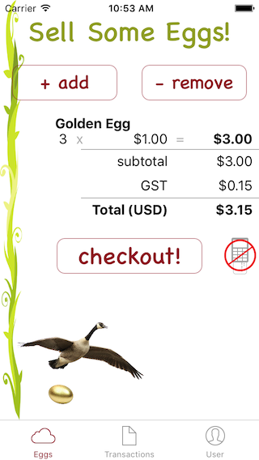

# Beanstream iOS SDK Sample App

The purpose of this sample app is to show how to use the Beanstream SDK for iOS.
 
This image shows a simple e-commerce type app that only sells golden eggs. The user selects the number of golden eggs to purchase, at a price of $1 each. The running total converts to the country currency of the device’s location. A fictitious sales tax of 5% is also added.
 
This app was written in Swift, to allow the example code to be as concise as possible, and to demonstrate support for Swift. The demo app was setup to use CocoaPoads to automate the management of dependencies. These dependencies include ReactiveCocoa, MBProgessHUD, Money, and most importantly Beanstream.SDK. You also need to manually install an unmanaged dependency called [Beanstream SDK API Simulator](https://github.com/Beanstream/beanstream-ios-apisimulator).

Note that the Beanstream SDK itself has CocoaPods specified dependencies that include AFNetworking v2.6.0.

To be able to compile this project you can clone the git source repo to a working directory. As dependencies you will also need to clone the Beanstream API Simulator repo and then ensure all other dependencies are installed via CocoaPods.

Prerequisites:

First install [CocoaPods](https://cocoapods.org) and a plug-in to access our Artifactory repository.

```
> sudo gem install cocoapods
> sudo gem install cocoapods-art
```

Next ensure you have your Artifactory credentials setup by Beanstream Developer Support and apply them to a .netrc file in your $HOME directory.

```
machine beanstream.artifactoryonline.com
login <USERNAME>
password <PASSWORD>
```

Add the Beanstream Partner/Artifactory repo.

```
> pod repo-art add beanstream-partner "https://beanstream.artifactoryonline.com/beanstream/api/pods/beanstream-partner"
```

The following projects should be cloned into the same root directory.

## 1.) Setup Beanstream SDK API Simulator

```
> git clone https://github.com/Beanstream/beanstream-ios-apisimulator.git
```

Note that the default resulting directory name "beanstream-ios-apisimulator" should be maintained for a referenced relative directory path to resolve correctly.

### Optional: Only if you wish to be able to build the simulator

```
> cd beanstream-ios-apisimulator
> pod install
> open APISimulator.xcworkspace
```

## 2.) Setup Beanstream SDK Sample App

```
> git clone https://github.com/Beanstream/beanstream-ios-apisample.git
> cd beanstream-ios-apisample
> pod install
> open GoldenEggs.xcworkspace
```

This demo project has simply created a reference to the main APISimulator source directory to be able to import its BICBeanstreamAPISimulator.h into the GoldenEggs-Bridging-Header.h. The BICBeanstreamAPISimulator class extends and overrides all needed methods in the BICBeanstreamAPI class (which is what you would use in an actual production mode app).

For more info on how to use the Beanstream SDK check out [developer.beanstream.com](http://developer.beanstream.com).
